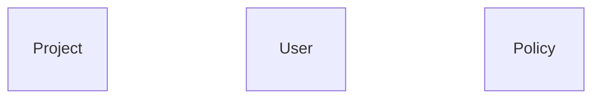
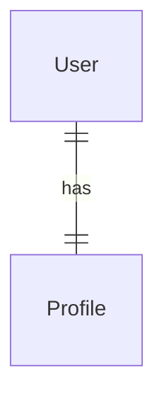
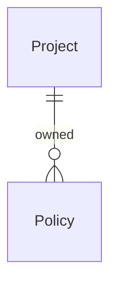
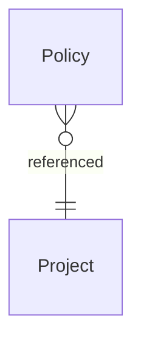
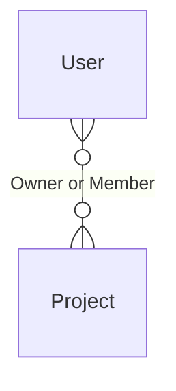
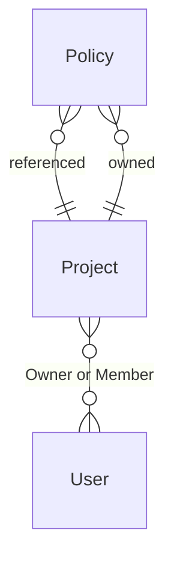

# Reading the Diagrams

Every rendered model opens with a diagram — a Mermaid **entity-relationship (ER)
diagram** in *crow's-foot* notation. It's a compact map of the nouns in the
domain and how they connect. If you haven't read one before, this page is the
key.

The diagrams render automatically on GitHub and in the docs site (every fenced
` ```mermaid ` block below is a live diagram). You never write this notation by
hand — `modelith render` generates it from the `*.modelith.yaml`.

## What the diagram shows (and what it doesn't)

The ER diagram shows **two things**: the entities (the named concepts) and the
**relationships** between them. That's deliberate. Everything else about an
entity — its attributes, actions, and the invariants that govern it — lives in
the Markdown sections *below* the diagram, not inside it.

So the boxes are intentionally **empty** — each entity is just a plain labeled
box with no rows inside it:



Three entities, no connections drawn yet. In a generic ER diagram a box would
list the entity's attributes in those rows; modelith leaves them out because a
domain model's conceptual types (enums, derived values) don't map cleanly onto
ER attribute types — you read those in the per-entity tables instead. (If you
look at the raw Mermaid *source* behind the diagram, each entity is written
`Project {}`; the empty `{}` is that intentionally-blank attribute list. You
won't see the braces in the rendered picture — just the empty box.) **The
diagram is the structure; the text is the detail.**

## The lines: relationships and cardinality

A line between two entities is a relationship. The **symbols at each end** tell
you *how many* of that entity participate — this is crow's-foot notation. Read
the symbol nearest an entity as "how many of *this* entity relate to *one* of
the other."

modelith uses just two endpoint symbols:

| Symbol | At an entity's end, means |
| --- | --- |
| `││` (two bars) | **exactly one** |
| `>○` (crow's foot + circle) | **zero or many** |

Combine the two ends and you get the four cardinalities a model can declare.
Each example below is exactly what modelith emits for that cardinality.

### `1:1` — one to one



A bar (`|`) at both ends: **one** `User` relates to **one** `Profile`, and vice
versa.

### `1:n` — one to many



A bar at `Project`, a crow's foot at `Policy`: **one** `Project` relates to
**zero or many** `Policies`, and each `Policy` relates back to exactly **one**
`Project`. This is the most common shape.

### `n:1` — many to one



The mirror of the above, declared from the *many* side. **Many** `Policies` to
**one** `Project`. `1:n` and `n:1` describe the same shape from opposite ends —
which one you see just reflects which entity declared it.

### `n:n` — many to many



A crow's foot at both ends: **many** `Users` relate to **many** `Projects`. A
`User` can be in several `Projects`; a `Project` can have several `Users`.

## The labels on the lines

Every line carries a quoted label. It comes from the first of these that the
model provides, so a label means one of three things:

1. **A role** describing the relationship — e.g. `"Owner or Member"`. The most
   descriptive label; written when the relationship plays a named part in the
   domain.
2. **Ownership** — `"owned"` or `"referenced"`:
   - **`owned`** (composition): the related entity is a *part of* this one and
     can't exist without it — delete the parent and it goes too. A `Policy` is
     `owned` by its `Project`.
   - **`referenced`**: the related entity is independent; this one merely points
     at it. A `Project` *references* the `Users` on it — deleting the `Project`
     doesn't delete the `Users`.
3. **The raw cardinality** (e.g. `"1:n"`) — a fallback when neither a role nor
   ownership was specified.

Crow's-foot notation has no glyph for ownership, so **the label is the only
place owned-vs-referenced appears in the diagram.** Worth internalizing: two
lines can look identical and mean very different things depending on whether the
label says `owned` or `referenced`.

## What the diagram can't tell you

The notation is structural, so some rules simply aren't expressible in it — read
them in the text:

- **"At least one"** isn't drawable here. modelith renders the "many" side as
  *zero* or many (`>○`). A rule like *"a `Project` must always have at least one
  `Owner`"* is an **invariant**, listed under the entity — not something the
  crow's foot captures.
- **Attributes, derived values, and enums** are in the per-entity tables and the
  Enums section.
- **Actions** (what can be done to an entity, and which invariants they
  preserve) are listed per entity.

## A full example, read end to end

Here is the diagram modelith renders for the [worked example](https://github.com/stacklok/modelith/blob/main/examples/example.modelith.md):



Reading each line:

- **`Policy }o--|| Project : "referenced"`** — zero-or-many `Policies` point at
  exactly one `Project`; from the `Policy` side, this is a reference to its
  owning project.
- **`Project }o--o{ User : "Owner or Member"`** — many-to-many between
  `Projects` and `Users`, where a `User`'s role is `Owner` or `Member`.
- **`Project ||--o{ Policy : "owned"`** — one `Project` owns zero-or-many
  `Policies`; the `owned` label says the `Policies` are part of the `Project` and
  die with it.

Notice the `Project`–`Policy` pair has **two lines** (`referenced` and `owned`):
the example declares that relationship from *both* entities, each with its own
label. modelith keeps both because their labels differ — it's showing you both
points of view. Usually you'll declare a relationship from one side and see a
single line. (The two declarations must agree on cardinality, or `modelith lint`
flags a contradiction.)

To go deeper on the underlying fields, see the [Schema
Reference](./06-schema-reference.md).
