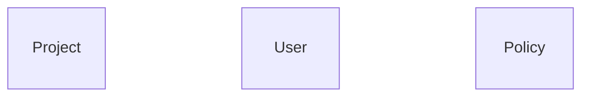
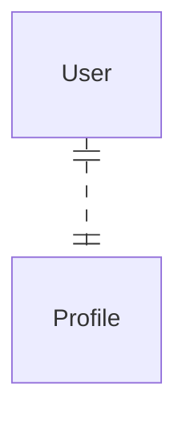
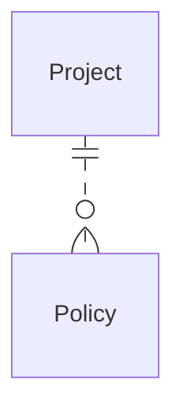
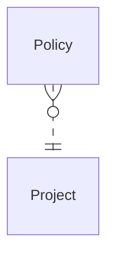
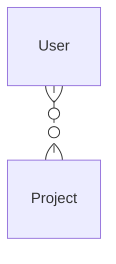
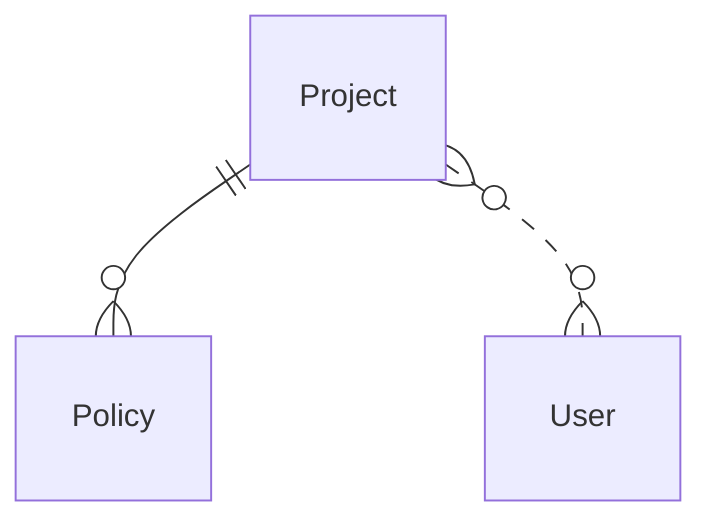
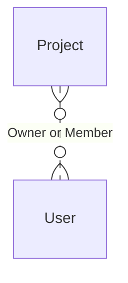
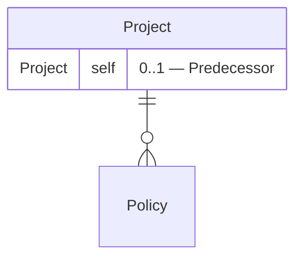
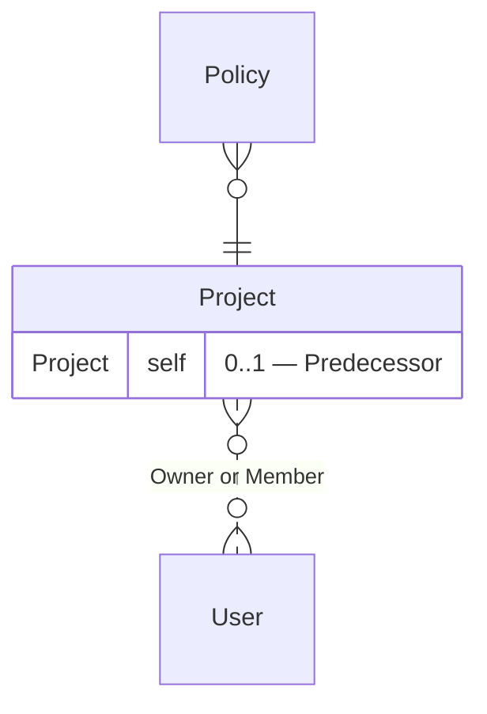

# Reading the Diagrams

Every rendered model opens with a diagram — a Mermaid **entity-relationship (ER)
diagram** in *crow's-foot* notation. It's a compact map of the nouns in the
domain and how they connect. If you haven't read one before, this page is the
key.

The diagrams render automatically on GitHub and in the docs site (every fenced
` ```mermaid ` block below is a live diagram). You never write this notation by
hand — `modelith render` generates it from the `*.modelith.yaml`.

## What the diagram shows (and what it doesn't)

The ER diagram shows **two things**: the entities (the named concepts) and the
**relationships** between them. That's deliberate. Everything else about an
entity — its attributes, actions, and the invariants that govern it — lives in
the Markdown sections *below* the diagram, not inside it.

So the boxes are usually **empty** — each entity is just a plain labeled box
with no rows inside it:


```mermaid
erDiagram
    Project {}
    User {}
    Policy {}
```

Three entities, no connections drawn yet. In a generic ER diagram a box would
list the entity's attributes in those rows; modelith leaves them out because a
domain model's conceptual types (enums, derived values) don't map cleanly onto
ER attribute types — you read those in the per-entity tables instead. (If you
look at the raw Mermaid *source* behind the diagram, each entity is written
`Project {}`; the empty `{}` is that intentionally-blank attribute list. You
won't see the braces in the rendered picture — just the empty box.) **The
diagram is the structure; the text is the detail.**

The one exception is an entity related to *itself*, which appears as a row
inside its own box — see [Self-relationships](#self-relationships-live-inside-the-box).

## The lines: relationships and cardinality

A line between two entities is a relationship. The **symbols at each end** tell
you *how many* of that entity participate — this is crow's-foot notation. Read
the symbol nearest an entity as "how many of *this* entity relate to *one* of
the other."

modelith uses just two endpoint symbols:

| Symbol | At an entity's end, means |
| --- | --- |
| `││` (two bars) | **exactly one** |
| `>○` (crow's foot + circle) | **zero or many** |

Combine the two ends and you get the four cardinalities a model can declare.
Each example below is exactly what modelith emits for that cardinality when the
relationship declares no role and no ownership — which is why the lines are
dashed and the labels empty. Both are explained in the next two sections.

### `1:1` — one to one


```mermaid
erDiagram
    User ||..|| Profile : ""
```

A bar (`|`) at both ends: **one** `User` relates to **one** `Profile`, and vice
versa.

### `1:n` — one to many


```mermaid
erDiagram
    Project ||..o{ Policy : ""
```

A bar at `Project`, a crow's foot at `Policy`: **one** `Project` relates to
**zero or many** `Policies`, and each `Policy` relates back to exactly **one**
`Project`. This is the most common shape.

### `n:1` — many to one


```mermaid
erDiagram
    Policy }o..|| Project : ""
```

The mirror of the above, declared from the *many* side. **Many** `Policies` to
**one** `Project`. `1:n` and `n:1` describe the same shape from opposite ends —
which one you see just reflects which entity declared it.

### `n:n` — many to many


```mermaid
erDiagram
    User }o..o{ Project : ""
```

A crow's foot at both ends: **many** `Users` relate to **many** `Projects`. A
`User` can be in several `Projects`; a `Project` can have several `Users`.

## The line style: owned vs referenced

The line itself is either **solid** or **dashed**, and that is where a
relationship's `ownership` shows up:

| Line | Means |
| --- | --- |
| **solid** (`--`) | **`owned`** (composition, an *identifying* relationship): the related entity is a *part of* this one and can't exist without it — delete the parent and it goes too. |
| **dashed** (`..`) | **`referenced`** (a *non-identifying* relationship): the related entity is independent; this one merely points at it. This is the default when a relationship doesn't say. |


```mermaid
erDiagram
    Project ||--o{ Policy : ""
    Project }o..o{ User : ""
```

A `Policy` is `owned` by its `Project` — solid. A `Project` merely *references*
the `Users` on it — dashed; deleting the `Project` doesn't delete the `Users`.

Ownership belongs to the relationship, not to the end that declared it. If a
`Project` says it owns its `Policies` and the `Policy` says it references its
`Project`, that's one identifying relationship seen from both ends, so it draws
as a single solid line.

## The labels on the lines

A label on a line is the relationship's **`role`** — the part the related entity
plays, e.g. `"Owner or Member"`. Nothing else is ever written there: a
relationship with no role gets an empty label.


```mermaid
erDiagram
    Project }o..o{ User : "Owner or Member"
```

That's a deliberate diet. Ownership is in the line style, and the exact
cardinality (`1:0..1`, `1:2`) is in the per-entity table below the diagram —
spending label space on either would crowd out the roles and, for long text,
collide with neighbouring lines. Keep a `role` to a short role name, ideally a
glossary term; `modelith lint` warns when a role reads as prose and points you
at the relationship's `note` field instead.

## Self-relationships live inside the box

When an entity relates to *itself* — a `Project` that replaced an earlier one, a
`Task` that blocks another `Task` — the relationship is drawn as a **row inside
that entity's box** rather than as a line looping back on it:


```mermaid
erDiagram
    Project {
        Project self "0..1 — Predecessor"
    }
    Policy {}
    Project ||--o{ Policy : ""
```

Read the row as: this `Project` relates to `0..1` other `Project`, which plays
the role `Predecessor`. Because there's no line to carry it, the row spells out
the cardinality, the word `owned` when the relationship is owned, and the role.
An entity with several self-relationships gets one row each (`self`, `self2`, …).

This is a layout necessity, not a modeling statement: Mermaid's ER layout has no
self-loop handling and draws an arc that swamps the rest of the diagram. See
[ADR-0008](https://github.com/stacklok/modelith/blob/main/project-docs/adr/0008-er-diagram-conventions.md).

## What the diagram can't tell you

The notation is structural, so some rules simply aren't expressible in it — read
them in the text:

- **"At least one"** isn't drawable here. modelith renders the "many" side as
  *zero* or many (`>○`). A rule like *"a `Project` must always have at least one
  `Owner`"* is an **invariant**, listed under the entity — not something the
  crow's foot captures.
- **Attributes, derived values, and enums** are in the per-entity tables and the
  Enums section.
- **Actions** (what can be done to an entity, and which invariants they
  preserve) are listed per entity.

## A full example, read end to end

Here is the diagram modelith renders for the [worked example](https://github.com/stacklok/modelith/blob/main/examples/example.modelith.md):


```mermaid
erDiagram
    Policy {}
    Project {
        Project self "0..1 — Predecessor"
    }
    User {}
    Policy }o--|| Project : ""
    Project }o..o{ User : "Owner or Member"
```

Reading it:

- **`Policy }o--|| Project : ""`** — zero-or-many `Policies` to exactly one
  `Project`, on a **solid** line: the `Policies` are part of the `Project` and
  die with it. The example declares this relationship from *both* entities
  (`Project` owns `Policy`; `Policy` references its `Project`) — one
  relationship seen from two ends, so it draws once. The two declarations must
  agree on cardinality, or `modelith lint` flags a contradiction.
- **`Project }o..o{ User : "Owner or Member"`** — many-to-many between
  `Projects` and `Users` on a **dashed** line: a `User`'s role is `Owner` or
  `Member`, and neither entity is part of the other.
- **the `Project self` row** — a `Project` optionally points at the archived
  `Project` it replaced, its `Predecessor`.

To go deeper on the underlying fields, see the [Schema
Reference](./06-schema-reference.md).
