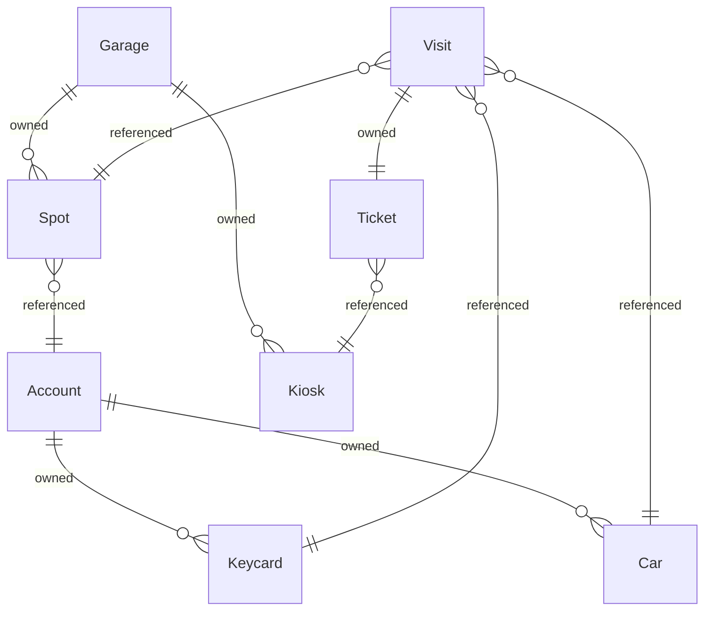

{/* Generated by `modelith render`. Do not edit by hand; edit the .modelith.yaml source and re-render. */}

# Parking Garage

Tracks the state of a single parking garage: its spots, the cars that occupy them, and the two ways a car enters — a monthly parker's keycard or a temporary visitor's pay-on-exit ticket.

## Glossary

- **`Driver`** — A person who enters and exits using a monthly `Account`'s `Keycard`. The human behind a `Car`; not modeled as an entity.
- **`Operator`** — Garage staff or management who open `Account`s, issue `Keycard`s, register `Car`s, designate reserved `Spot`s, and otherwise administer the `Garage`. A human role, not modeled as an entity.
- **`Visitor`** — A person with no `Account` who enters by taking a `Ticket` and pays at a `Kiosk` before exit. Not modeled as an entity.

## Enums

### `AccountStatus`

The billing standing of an `Account`.

| Value | Definition |
| --- | --- |
| `active` | In good standing; its `Keycard`s open the gate. |
| `suspended` | Billing lapsed or administratively held; its `Keycard`s are refused at the gate until reinstated. |

### `SpotKind`

Whether a `Spot` is open to all entrants or reserved for one `Account`.

| Value | Definition |
| --- | --- |
| `general` | Any entrant — monthly or temporary — may occupy this `Spot`. |
| `reserved` | Assigned to one `Account`; only that account's `Car`s may occupy it. |

## Entities

### `Account`

The billing entity for monthly parking. An `Account` owns one or more `Keycard`s (gate access for its drivers) and registers one or more `Car`s. An `Account` may additionally pay extra for one or more reserved `Spot`s — any of the account's `Car`s may use any of its reserved `Spot`s — but an `Account` need have no reserved `Spot` at all: its `Keycard` holders still have gate access and park in general `Spot`s like any visitor. Temporary visitors have no `Account` — they enter with a `Ticket`.

**Relationships**

- `Keycard` — 1:n — owned — One per driver who needs gate access; independent of how many reserved `Spot`s, if any, the `Account` holds.
- `Car` — 1:n — owned

**Attributes**

| Name | Type | Description |
| --- | --- | --- |
| `holderName` | string | The customer the account bills to. |
| `billingEmail` | string |  |
| `status` | AccountStatus |  |
| `reservedSpotCount` | integer | _Derived:_ The number of `Spot`s assigned to this `Account`. |

**Actions**

- `open-account` — actor `Operator`
- `issue-keycard` — actor `Operator`; preserves keycard-one-account, account-keycard-required
- `register-car` — actor `Operator`; preserves car-one-account
- `suspend` — actor `Operator` — Set `status` to suspended; gate access is refused until reinstated.
- `close-account` — actor `Operator`

**Invariants**

- **account-keycard-required** — An `Account` has at least one `Keycard`.
- **account-spots-within-keycards** — An `Account` holds no more reserved `Spot`s than it has `Keycard`s — every reserved `Spot` needs a `Keycard` to use it. An `Account` may hold zero reserved `Spot`s.

### `Car`

A vehicle registered to a monthly `Account`, together with its metadata (plate, make, model, and so on). Only monthly parkers' vehicles are tracked as a `Car`; a temporary visitor's vehicle is captured only as a plate on their `Ticket`, never as a `Car`.

**Attributes**

| Name | Type | Description |
| --- | --- | --- |
| `plate` | string | License plate; how a `Car` is recognized at the gate. |
| `make` | string |  |
| `model` | string |  |
| `color` | string |  |

**Invariants**

- **car-one-account** — A `Car` is registered to exactly one `Account`.

### `Garage`

A single physical parking structure whose `Spot`s the system tracks. It is the top-level container: every `Spot` and `Kiosk` belongs to exactly one `Garage`. Multi-site operation (several structures under one operator) is intentionally out of scope for now.

**Relationships**

- `Spot` — 1:n — owned
- `Kiosk` — 1:n — owned

**Attributes**

| Name | Type | Description |
| --- | --- | --- |
| `name` | string | Human-facing name of the structure. |
| `address` | string |  |
| `availableSpots` | integer | _Derived:_ The number of `Spot`s in this `Garage` that have no active `Visit`. |

**Invariants**

- **garage-capacity** — The number of active `Visit`s in a `Garage` never exceeds its number of `Spot`s.

### `Keycard`

A physical access credential issued to an `Account` that opens the gate for monthly parkers. A `Keycard` belongs to exactly one `Account` and is reused across many `Visit`s. It identifies the account, not a specific `Car`, and is not bound to any particular `Spot` — it simply grants gate access for one of the account's drivers.

**Attributes**

| Name | Type | Description |
| --- | --- | --- |
| `cardNumber` | string | The credential's unique identifier, encoded on the card. |
| `enabled` | boolean | False once deactivated; a disabled `Keycard` is refused at the gate. |
| `inUse` | boolean | _Derived:_ True while this `Keycard` has an active `Visit` — its car is in the `Garage`. This is the state that enforces anti-passback. |

**Actions**

- `deactivate` — actor `Operator` — Set `enabled` to false, e.g. on a lost card.

**Invariants**

- **keycard-one-account** — A `Keycard` belongs to exactly one `Account`.
- **keycard-one-active-visit** — A `Keycard` is associated with at most one active `Visit` at a time, and may not start a new `Visit` while it already has an active one.

### `Kiosk`

A payment station within a `Garage` where temporary visitors pay their `Ticket` before exiting. A `Kiosk` belongs to one `Garage` and processes many `Ticket` payments. Monthly parkers using a `Keycard` do not interact with a `Kiosk`.

**Attributes**

| Name | Type | Description |
| --- | --- | --- |
| `label` | string | Where the `Kiosk` stands, e.g. "Level 1 elevator lobby". |

**Invariants**

- **kiosk-same-garage** — A `Ticket` may be paid only at a `Kiosk` in the same `Garage` as the `Ticket`'s `Visit`.

### `Spot`

A single parking space within a `Garage`. A `Spot` is either general (any entrant may use it) or reserved — assigned to one monthly `Account`, whose registered `Car`s alone may park there. At any moment a `Spot` is occupied by at most one active `Visit`.

**Relationships**

- `Account` — n:1 — referenced — Set only for a reserved `Spot`: the monthly `Account` it is assigned to. A general `Spot` has no assignment.

**Attributes**

| Name | Type | Description |
| --- | --- | --- |
| `label` | string | Where the `Spot` is, e.g. "A-114". |
| `kind` | SpotKind | _Derived:_ `reserved` if an `Account` is assigned to this `Spot`, otherwise `general`. |
| `occupied` | boolean | _Derived:_ True if this `Spot` currently has an active `Visit`. |

**Actions**

- `designate-reserved` — actor `Operator`; preserves account-spots-within-keycards — Assign this `Spot` to an `Account`, making it reserved.
- `release-reservation` — actor `Operator` — Unassign the `Account`, returning the `Spot` to general use.

**Invariants**

- **spot-single-occupant** — A `Spot` holds at most one active `Visit` at any moment.
- **reserved-spot-restricted** — A reserved `Spot` may be occupied only by a `Car` registered to the `Account` it is assigned to.

### `Ticket`

A temporary entry credential issued at the gate to a visitor with no `Account`. It records the entry time and the captured plate, and is paid at a `Kiosk` before exit. Each `Ticket` belongs to exactly one `Visit`.

**Relationships**

- `Kiosk` — n:1 — referenced — The `Kiosk` where the `Ticket` is paid on exit; unset until paid.

**Attributes**

| Name | Type | Description |
| --- | --- | --- |
| `plate` | string | The plate captured at the gate; the only record of a visitor's car. |
| `issuedAt` | timestamp |  |
| `amountDue` | integer | Fee owed, in the smallest currency unit. _Derived:_ Computed at payment time from the parking duration (issue time to now) and the `Garage`'s rate schedule. |
| `paidAt` | timestamp | When the `Ticket` was paid; unset until then. |
| `paid` | boolean | _Derived:_ True once `paidAt` is set. |

**Actions**

- `pay` — actor `Visitor`; preserves kiosk-same-garage — Pay the fee at a `Kiosk`, setting `paidAt` and unlocking exit.

**Invariants**

- **ticket-paid-before-exit** — A `Ticket` must be paid at a `Kiosk` before its `Visit` may exit the `Garage`.

### `Visit`

One car's stay in the `Garage`, from entry to exit, occupying a single `Spot`. Every `Visit` is started by exactly one credential — a `Keycard` (monthly) or a `Ticket` (temporary), never both. The `Visit` is the central record tying together the `Spot`, the entrant, and the entry and exit times.

**Relationships**

- `Spot` — n:1 — referenced
- `Car` — n:1 — referenced — The registered `Car`, when the entrant is a monthly parker and the vehicle is identified; absent for temporary visitors.
- `Keycard` — n:1 — referenced — Present when entry was by `Keycard` (monthly).
- `Ticket` — 1:1 — owned — Present when entry was by `Ticket` (temporary); created together with the `Visit`.

**Attributes**

| Name | Type | Description |
| --- | --- | --- |
| `entryAt` | timestamp | When the car entered and the `Visit` began. |
| `exitAt` | timestamp | When the car left; unset while the `Visit` is active. |
| `active` | boolean | _Derived:_ True while `exitAt` is unset — the car is still in the `Garage`. |

**Actions**

- `enter-with-keycard` — actor `Driver`; preserves visit-one-credential, spot-single-occupant, reserved-spot-restricted, keycard-one-active-visit, garage-capacity — A monthly `Driver` swipes a `Keycard`; a `Visit` starts on a `Spot`.
- `enter-with-ticket` — actor `Visitor`; preserves visit-one-credential, spot-single-occupant, garage-capacity — A `Visitor` takes a `Ticket` at the gate; a `Visit` starts on a general `Spot`.
- `exit-monthly` — actor `Driver`; preserves visit-exit-after-entry — A `Driver` swipes out; `exitAt` is set and the `Spot` is freed.
- `exit-temporary` — actor `Visitor`; preserves ticket-paid-before-exit, visit-exit-after-entry — A `Visitor` exits after paying; `exitAt` is set and the `Spot` is freed.

**Invariants**

- **visit-one-credential** — Every `Visit` is started by exactly one credential — a `Keycard` or a `Ticket`, never both and never neither.
- **visit-exit-after-entry** — A `Visit`'s exit time, once set, is at or after its entry time.

## Relationships

## Scenarios

### Monthly parker uses a reserved spot

**Actors:** Account, Car, Keycard, Spot, Visit

**Steps**

1. A customer holds an `Account` with a registered `Car` and an assigned reserved `Spot`.
2. The customer swipes their `Keycard` at the gate; the system opens it and starts a `Visit` on the assigned `Spot`, with no `Ticket`.
3. The `Visit` records the `Car` and the entry time; the reserved `Spot` now holds one active `Visit`.
4. On return, the customer swipes the `Keycard` to exit; the `Visit`'s exit time is set and the `Spot` is freed. No `Kiosk` payment occurs.

**Invariants touched**

- **visit-one-credential** — Every `Visit` is started by exactly one credential — a `Keycard` or a `Ticket`, never both and never neither.
- **spot-single-occupant** — A `Spot` holds at most one active `Visit` at any moment.
- **reserved-spot-restricted** — A reserved `Spot` may be occupied only by a `Car` registered to the `Account` it is assigned to.
- **visit-exit-after-entry** — A `Visit`'s exit time, once set, is at or after its entry time.

### Monthly parker without a reserved spot uses a general spot

**Actors:** Account, Car, Keycard, Spot, Visit

**Steps**

1. A customer holds an `Account` with a `Keycard` and a registered `Car` but pays for no reserved `Spot`.
2. The customer swipes their `Keycard`; the gate opens and a `Visit` starts on any free general `Spot`, with no `Ticket` and no `Kiosk` payment.
3. On exit the customer swipes the `Keycard` again; the `Visit`'s exit time is set and the general `Spot` is freed.

**Invariants touched**

- **visit-one-credential** — Every `Visit` is started by exactly one credential — a `Keycard` or a `Ticket`, never both and never neither.
- **spot-single-occupant** — A `Spot` holds at most one active `Visit` at any moment.
- **visit-exit-after-entry** — A `Visit`'s exit time, once set, is at or after its entry time.

### A keycard already in use cannot start a second visit

**Actors:** Keycard, Visit

**Steps**

1. A `Keycard` has an active `Visit` — its car is currently in the `Garage`.
2. Someone presents the same `Keycard` at the entry gate again.
3. The gate stays shut; the `Keycard` cannot start a second `Visit` while its first is still active — the car must exit first.

**Invariants touched**

- **keycard-one-active-visit** — A `Keycard` is associated with at most one active `Visit` at a time, and may not start a new `Visit` while it already has an active one.

### Temporary visitor takes a ticket and pays on exit

**Actors:** Ticket, Visit, Spot, Kiosk

**Steps**

1. A visitor with no `Account` takes a `Ticket` at the gate; the system captures the plate and starts a `Visit` on a general `Spot`, with no `Keycard`.
2. The visitor parks; the general `Spot` holds one active `Visit`.
3. Before leaving, the visitor pays the `Ticket` at a `Kiosk` in the same `Garage`.
4. With the `Ticket` paid, the exit gate opens; the `Visit`'s exit time is set and the `Spot` is freed.

**Invariants touched**

- **visit-one-credential** — Every `Visit` is started by exactly one credential — a `Keycard` or a `Ticket`, never both and never neither.
- **ticket-paid-before-exit** — A `Ticket` must be paid at a `Kiosk` before its `Visit` may exit the `Garage`.
- **kiosk-same-garage** — A `Ticket` may be paid only at a `Kiosk` in the same `Garage` as the `Ticket`'s `Visit`.
- **spot-single-occupant** — A `Spot` holds at most one active `Visit` at any moment.
- **visit-exit-after-entry** — A `Visit`'s exit time, once set, is at or after its entry time.

### Unpaid ticket is refused at exit

**Actors:** Ticket, Visit, Kiosk

**Steps**

1. A temporary `Visit` is active with an unpaid `Ticket`.
2. The visitor drives to the exit without paying at a `Kiosk`.
3. The system refuses to open the exit gate because the `Ticket` is unpaid; the `Visit` stays active and its `Spot` stays occupied.

**Invariants touched**

- **ticket-paid-before-exit** — A `Ticket` must be paid at a `Kiosk` before its `Visit` may exit the `Garage`.

### A car not on the account is denied a reserved spot

**Actors:** Spot, Account, Car, Visit

**Steps**

1. A reserved `Spot` is assigned to an `Account`.
2. A `Car` that is not registered to that `Account` attempts to park in the reserved `Spot`.
3. The system denies the `Visit`; only a `Car` registered to the assigned `Account` may occupy the reserved `Spot`.

**Invariants touched**

- **reserved-spot-restricted** — A reserved `Spot` may be occupied only by a `Car` registered to the `Account` it is assigned to.

### Garage fills up

**Actors:** Garage, Spot, Visit

**Steps**

1. Every `Spot` in the `Garage` holds an active `Visit`.
2. A new car arrives at the gate.
3. The system has no free `Spot`, so it does not start a new `Visit`; the count of active `Visit`s never exceeds the `Garage`'s `Spot` count.

**Invariants touched**

- **garage-capacity** — The number of active `Visit`s in a `Garage` never exceeds its number of `Spot`s.
- **spot-single-occupant** — A `Spot` holds at most one active `Visit` at any moment.

