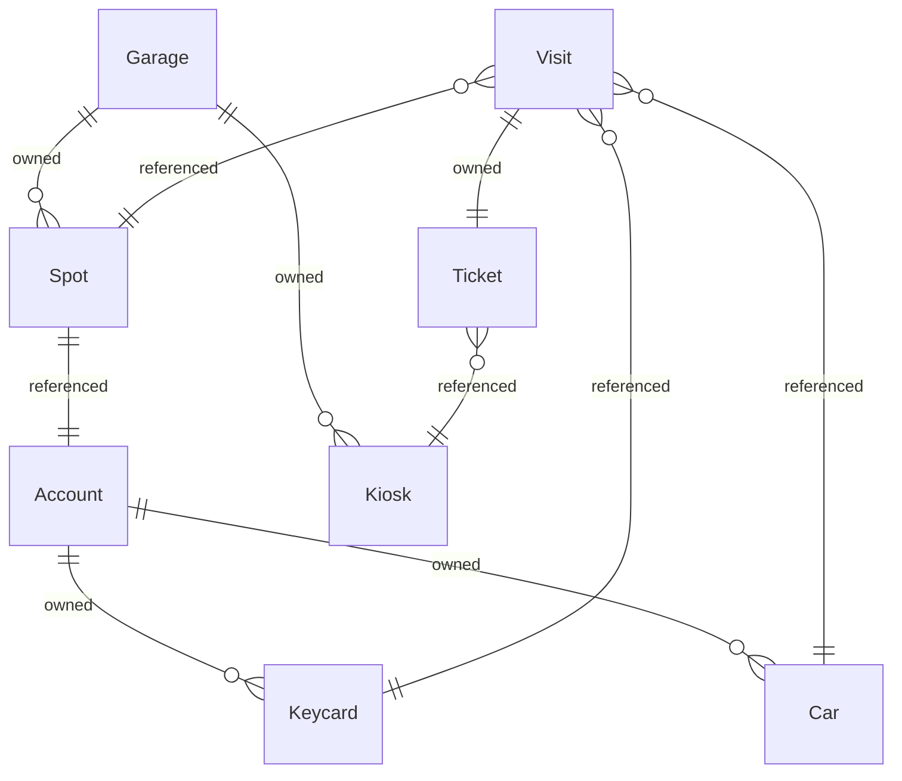

# Worked Example: Parking Garage

Now that you've seen the parts — [authoring with the
agent](../02-getting-started.md), the [model's
structure](../03-understanding-your-model.md), and [reading the
diagrams](../04-reading-the-diagrams.md) — this is **bringing it all together** on a
meaty example.

It's a real session with the [`domain-model-author`](../02-getting-started.md)
skill, lightly edited for length. It builds a parking-garage model **from
nothing** — no YAML written by hand — and shows the loop you'll actually run: the
agent asks the questions, you make the calls, it drafts and lints the YAML and
keeps the rendered Markdown in sync.

The point isn't the typing. It's the **questions** — where the agent makes you
decide what a concept *is*, and where it refuses to encode something until an
ambiguity is resolved.

The finished artifacts:

- **[The rendered model](./garage.modelith.md)** — the diagram + tables a reader
  sees (this is what gets committed and circulated).
- **[The source `garage.modelith.yaml`](https://github.com/stacklok/modelith/blob/main/docs/05-parking-garage/garage.modelith.yaml)**
  — the canonical YAML the conversation produced.

---

## Getting started

> **You:** I want to build a system to track a parking garage. I think the top
> level is `Garage` or `Location`, and off of that an array of `Spot`s. Some
> spots are reserved and some aren't. There's a `Car` with some metadata. Cars
> enter two ways — a keycard for monthly parking, or a temporary ticket paid at a
> kiosk on exit.
>
> **Agent:** Clean domain. Before I build anything, one thing you described
> points at a concept you *didn't* name — the **stay itself**: the period a car
> occupies the garage from entry to exit. That's almost certainly the central
> entity, and the keycard path and the ticket path are just two ways of *starting
> one*. I'll propose calling it `Visit`.
>
> A few decisions that shape everything else:
>
> 1. **Hierarchy** — flat `Garage → Spot`, or do you need `Level`/`Zone` in
>    between?
> 2. **Reserved spots** — is "reserved" a `Spot` assigned to a monthly account,
>    or a full booking system?
> 3. **The temporary visitor's car** — modeled as a `Car`, or just a plate
>    captured on the `Ticket`?
> 4. **Who owns what** — does an `Account` own its `Keycard`s and `Car`s?

The agent surfaced `Visit` before writing a line — the missing noun was the most
important decision in the model.

> **You:** Flat `Garage → Spot`, no `Level`. `Visit` is good. Reserved = a spot
> assigned to a monthly account. Temporary visitors are just a plate on the
> ticket — no `Car`. And yes, an `Account` owns its keycards and cars.

## Pass 1 — the skeleton

The agent names every entity, writes a crisp definition for each, and declares
the relationships and cardinality. **Nothing else** — no attributes, rules, or
scenarios yet. This is the highest-leverage step, and it already renders a real
ER diagram.

> **Agent:** Skeleton's in — 8 entities, lints with 0 errors. Here's the diagram:



> **Agent:** This is the minimum useful model — honest to stop here and
> circulate. Three things to sanity-check before I add behavior:
>
> 1. **`Spot → Account` is 1:1** — one reserved spot per parker. If a parker can
>    hold several, that's `n:1`.
> 2. **"exactly one of `Keycard` or `Ticket`" can't be drawn** — the diagram
>    shows both as possible. That becomes an **invariant** in Pass 2.
> 3. **No `Payment` entity** — I'm treating the kiosk payment as future
>    attributes on `Ticket`.

> **You:** Let's go `n:1` for spot→account. Any of the cars on an account can
> park in any of its spots.

A one-line change to the cardinality; the diagram updates to `Spot }o--|| Account`.

## Pass 2 — the behavior

With the skeleton settled, the agent adds **invariants** (rules that must always
hold) and **scenarios** (short narratives that exercise every entity).

> **Agent:** Pass 2 done — 9 invariants, every entity governed; 5 scenarios
> touching all 8 entities. One rule worth your eye: `account-keycard-required`
> ("an `Account` has at least one `Keycard`") is the most opinionated one. If
> accounts can exist before a card is issued, I should soften it.

This is where a vague idea turned into a sharper model:

> **You:** If we have multiple spots per account, they'll need multiple keycards
> too. An `Account` is really more of a **billing entity**. Be clear that an
> account holder with a keycard *can* have a reserved spot, or can just use
> general spots — you pay extra for a reserved one.
>
> **Agent:** Good — `Account` becomes the billing entity, and a reserved `Spot`
> is an optional paid upsell, not the defining feature. An account holder always
> gets gate access (≥1 `Keycard`) and parks in general spots like anyone else;
> paying extra buys reserved spots, but an account can have **zero**. No
> cardinality changes — this is a definition sharpening. I'll add a scenario for
> the "monthly parker with no reserved spot" path so it's exercised, not just
> asserted.

### Where the agent caught a contradiction

> **You:** That sounds like a good invariant — you shouldn't have more keycards
> than spots. Also, a keycard is tied to a `Visit`; you can't use the same
> keycard to start two visits at once. So there's state on a keycard for which
> visit it's in, if any.
>
> **Agent:** Two things, and one has a conflict I want to flag before encoding
> it.
>
> **Anti-passback** — "a keycard ties to one active `Visit`; can't start a second
> while in use" — is unambiguous. Adding it as an invariant and a scenario now.
>
> **The count rule conflicts with what we just built.** You said *"more keycards
> than spots"* — literally that's `keycards ≤ reserved spots`. But last turn we
> established an account can have a keycard and **zero** reserved spots (the
> general-spot parker). Under that rule, a 1-card / 0-spot account would be
> illegal. I think you mean the **inverse**: `reserved spots ≤ keycards` — you
> can't reserve more spots than you have cards to use them, and zero reserved is
> fine. I don't want to encode it backwards — which did you mean?

> **You:** Right, the inverse. Reserved spots ≤ keycards.

This is the skill earning its keep: it didn't silently take the instruction; it
noticed the new rule contradicted an established one and made the human resolve
it. The result is `account-spots-within-keycards`, stated the consistent way.

## Pass 3 — refinement

Last, the agent layers in **attributes** (including the *derived* "state" ones
the conversation surfaced), **enums**, **actions** tied to actors and the
invariants they preserve, and a **glossary** for the human roles — adding only
what earns its place.

> **Agent:** All three passes complete; lints 0/0. Pass 3 added:
>
> - **Glossary**: `Operator`, `Driver`, `Visitor` — human roles, none are
>   entities.
> - **Enums**: `SpotKind` (general/reserved), `AccountStatus` (active/suspended).
> - **The derived "state" attributes you intuited** — `Keycard.inUse` (the
>   anti-passback state), `Spot.occupied`/`Spot.kind`, `Visit.active`,
>   `Ticket.paid`, `Garage.availableSpots`.
> - **Actions** with actors + preserved invariants — notably `Visit`'s four paths
>   (`enter-with-keycard` / `enter-with-ticket` / `exit-monthly` /
>   `exit-temporary`).

The centerpiece is `Visit` — the entity the agent insisted on naming in turn one:

```yaml
Visit:
  definition: >-
    One car's stay in the `Garage`, from entry to exit, occupying a single
    `Spot`. Every `Visit` is started by exactly one credential — a `Keycard`
    (monthly) or a `Ticket` (temporary), never both.
  relationships:
    - entity: Spot
      cardinality: n:1
      ownership: referenced
    - entity: Keycard
      cardinality: n:1
      ownership: referenced
      note: Present when entry was by `Keycard` (monthly).
    - entity: Ticket
      cardinality: 1:1
      ownership: owned
      note: Present when entry was by `Ticket` (temporary).
  invariants:
    - id: visit-one-credential
      statement: >-
        Every `Visit` is started by exactly one credential — a `Keycard` or a
        `Ticket`, never both and never neither.
    - id: visit-exit-after-entry
      statement: A `Visit`'s exit time, once set, is at or after its entry time.
```

Notice `visit-one-credential`: the "exactly one of keycard or ticket" rule the
diagram couldn't express (both edges to `Visit` look optional) lives here as an
invariant. The diagram is the structure; the rules are the text. See
[Reading the Diagrams](../04-reading-the-diagrams.md) for why.

> **Agent:** Two loose ends I left deliberately (flagging, not fixing):
> `Ticket.amountDue` derives from a rate schedule that isn't modeled; and
> `AccountStatus.suspended`'s "keycards refused at the gate" behavior is described
> but not an invariant. Both are honest gaps — say the word if you want them
> tightened.

A model is never "finished." Leaving those visible — rather than inventing a rate
schedule or quietly asserting a rule — is the behavior you want.

## The result

**8 entities, 2 enums, 3 glossary roles, 11 invariants, 7 scenarios** — built in
one conversation, lints completely clean, rendered Markdown committed alongside
the source.

- **[Read the rendered model →](./garage.modelith.md)**
- **[View the full source YAML →](https://github.com/stacklok/modelith/blob/main/docs/05-parking-garage/garage.modelith.yaml)**

Want to try it yourself? See [Authoring with Agents](../02-getting-started.md).
