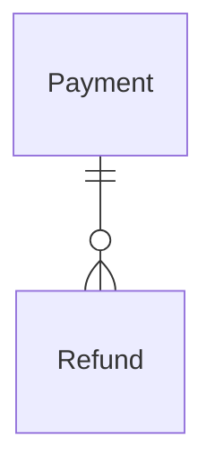

{/* Generated by `modelith render`. Do not edit by hand; edit the .modelith.yaml source and re-render. */}

# Payments

How money is taken and given back. A deliberately small context that owns the vocabulary of settling a charge — nothing in it knows what was bought, which is why the parking-garage model can reference its `PaymentMethod` instead of keeping a second copy of the same list.

## Glossary

- **`Merchant`** — Whoever took the money and can give it back. Issues a `Refund`; a role, not modeled as an entity.
- **`Payer`** — Whoever hands over the money for a `Payment` — a person at a terminal, or a standing arrangement charged automatically. A role, not modeled as an entity.

## Enums

### `PaymentMethod`

How a `Payment` was tendered.

| Value | Definition |
| --- | --- |
| `card` | A payment card, tapped or inserted at a terminal. |
| `cash` | Notes or coins, accepted by a machine or by a person. |
| `account` | Charged to a standing arrangement and settled later, so the `Payer` is billed rather than paying at the moment of the `Payment`. |

## Entities

### `Payment`

One completed transfer of money for one charge: an amount, the method it was tendered with, and the moment it succeeded. A `Payment` records a transfer that settled — a declined card produces no `Payment` — and its amount never changes afterwards; money given back is a `Refund`.

**Relationships**

- `Refund` — 1:n — owned — Money returned from this `Payment`. There may be several partial ones, and none at all is the ordinary case.

**Attributes**

| Name | Type | Description |
| --- | --- | --- |
| `amount` | integer | What was taken, in the smallest currency unit. |
| `method` | PaymentMethod |  |
| `settledAt` | timestamp | When the transfer succeeded. |
| `refundedTotal` | integer | _Derived:_ The sum of the amounts of this `Payment`'s `Refund`s. |

**Actions**

- `take` — actor `Payer`; preserves payment-amount-positive — Tender the amount and, on success, record the `Payment`.

**Invariants**

- **payment-amount-positive** — A `Payment`'s amount is greater than zero.
- **payment-method-fixed** — A `Payment`'s method is fixed once it has settled; paying a different way is a new `Payment`.

### `Refund`

Money returned from one `Payment`, in whole or in part. A `Refund` belongs to exactly one `Payment` and is always given back by the method that `Payment` used, so it carries no method of its own.

**Attributes**

| Name | Type | Description |
| --- | --- | --- |
| `amount` | integer | What was returned, in the smallest currency unit. |
| `issuedAt` | timestamp |  |

**Actions**

- `issue` — actor `Merchant`; preserves refund-within-payment, refund-after-settlement

**Invariants**

- **refund-within-payment** — The amounts of a `Payment`'s `Refund`s never total more than that `Payment`'s amount.
- **refund-after-settlement** — A `Refund` is issued at or after its `Payment` settled.

## Relationships

## Scenarios

### A charge is settled by card

**Actors:** Payer, Payment

**Steps**

1. A `Payer` is asked for an amount and taps a card at the terminal.
2. The card is accepted, so a `Payment` records the amount, the method `card`, and the moment it settled.
3. Asked later to pay the same charge by cash instead, the system declines: the settled `Payment`'s method does not change.

**Invariants touched**

- **payment-amount-positive** — A `Payment`'s amount is greater than zero.
- **payment-method-fixed** — A `Payment`'s method is fixed once it has settled; paying a different way is a new `Payment`.

### Part of a charge is given back

**Actors:** Merchant, Payment, Refund

**Steps**

1. A settled `Payment` of 500 exists, with nothing returned from it yet.
2. The `Merchant` issues a `Refund` of 200 against it; the `Payment`'s refunded total becomes 200.
3. A second `Refund` of 400 is attempted; the system refuses it, because the two together would exceed the `Payment`.

**Invariants touched**

- **refund-within-payment** — The amounts of a `Payment`'s `Refund`s never total more than that `Payment`'s amount.
- **refund-after-settlement** — A `Refund` is issued at or after its `Payment` settled.

