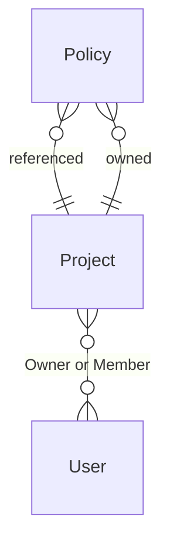

{/* Generated by `modelith render`. Do not edit by hand; edit the .modelith.yaml source and re-render. */}

# Example Domain Model

A small, illustrative model used in the docs and as a golden fixture for the tooling. It models `Projects`, the `Users` who own them, and the `Policies` they contain.

## Glossary

- **`Member`** — A `User` granted access to a `Project` without ownership rights.
- **`Owner`** — A `User` with full control of a `Project` — can transfer ownership, archive it, and manage its `Policies`.

## Enums

### `ProjectStatus`

Lifecycle state of a `Project`.

| Value | Definition |
| --- | --- |
| `active` | In normal use; `Policies` can be enabled. |
| `archived` | Retired and read-only; no `Policies` can be enabled. |

## Entities

### `Policy`

A rule set evaluated by the system, belonging to exactly one `Project`. A `Policy` has no meaning outside its owning `Project`.

**Relationships**

- `Project` — n:1 — referenced — The owning `Project`

**Attributes**

| Name | Type | Description |
| --- | --- | --- |
| `enabled` | boolean |  |

**Actions:** `create`, `enable`, `disable`, `delete`

**Invariants**

- **belongs-to-one-project** — Belongs to exactly one `Project`

### `Project`

A container for a set of related `Policies`, owned by at least one `User`. `Projects` are the primary unit of organization in the system.

**Relationships**

- `User` — n:n — referenced — `Owner` or `Member` — Must always have at least one `Owner`
- `Policy` — 1:n — owned

**Attributes**

| Name | Type | Description |
| --- | --- | --- |
| `status` | ProjectStatus |  |
| `enabledPolicyCount` | integer | _Derived:_ Number of `Policies` in this `Project` whose `enabled` is true. |

**Actions**

- `create`
- `archive` — actor `Owner`; preserves at-least-one-owner, no-archive-with-enabled-policies
- `transfer_ownership` — actor `Owner`; preserves at-least-one-owner

**Invariants**

- **at-least-one-owner** — Must have at least one `Owner` at all times
- **no-archive-with-enabled-policies** — Cannot be archived while it has enabled `Policies`

### `User`

A human principal who can own or belong to `Projects`. Identity is managed externally; a `User` here is the in-domain projection of that identity.

**Relationships**

- `Project` — n:n — referenced — `Owner` or `Member`

**Actions:** `invite`, `deactivate`

**Invariants**

- **unique-email** — Email address is unique across all `Users`

## Relationships

## Invariants

- **archived-project-has-no-enabled-policies** — When a `Project` is archived, none of its `Policies` remain enabled.

## Scenarios

### Transfer project ownership

Verifies the at-least-one-owner invariant holds throughout a hand-off: the new `Owner` is added before the previous one steps down.

**Actors:** Owner, TargetUser

**Steps**

1. `Owner` selects `TargetUser` as new `Owner`
2. `Project`.owner updated to `TargetUser`
3. Previous `Owner` role set to `Member`

**Invariants touched**

- **at-least-one-owner** — Must have at least one `Owner` at all times

### Archive a project with enabled policies

Stress-tests the no-archive-with-enabled-policies invariant: the system must disable all `Policies` before the `Project` status transitions to archived.

**Actors:** Owner

**Steps**

1. `Owner` attempts to archive a `Project` that still has enabled `Policies`
2. System disables each `Policy` before archiving
3. `Project`.status set to archived

**Invariants touched**

- **no-archive-with-enabled-policies** — Cannot be archived while it has enabled `Policies`
- **archived-project-has-no-enabled-policies** — When a `Project` is archived, none of its `Policies` remain enabled.

### Invite a user to a project

Happy-path onboarding: a new `User` is created if the email is unknown, then added as a `Member`. Verifies email uniqueness is enforced on `User` creation.

**Actors:** Owner, InvitedUser

**Steps**

1. `Owner` invites a `User` by email address to a `Project`
2. A new `User` record is created if the email is not already known
3. The `User` is added to the `Project` as a `Member`

**Invariants touched**

- **unique-email** — Email address is unique across all `Users`

